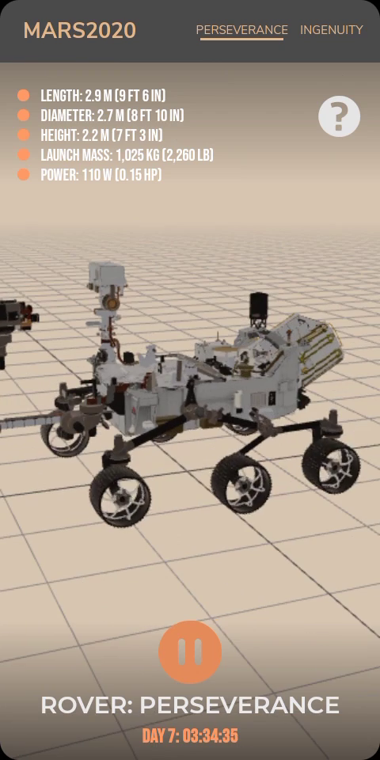

# Mars2020 3D Demo

Powered By React + ThreeJS

[View Live 🚀](https://mars2020.netlify.app)

This is the React version of a PWA i originally wrote in vanilaJS to celebrate the landing of rover perseverace and ingenuity helicopter on the red planet.

## Licensing

All models were obtain from NASA website and were only slightly modified. Models mainatin original license.

## Building

This was made using create-react-app with craco included to add some additional overrides.
